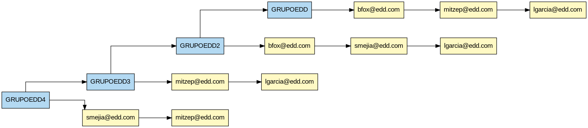
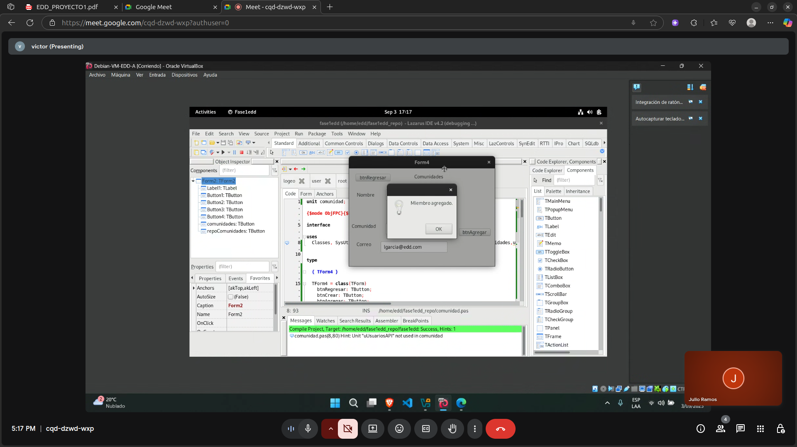
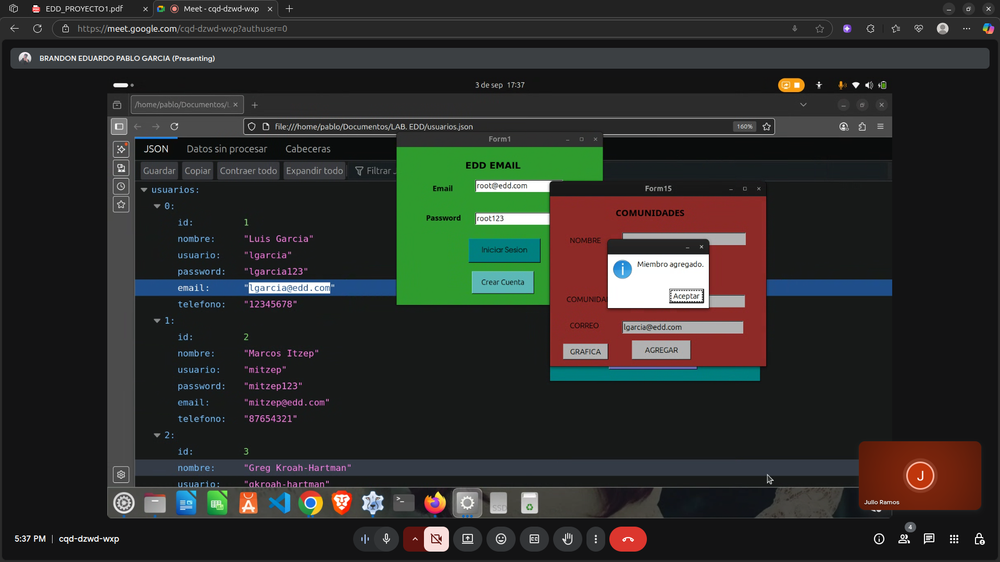
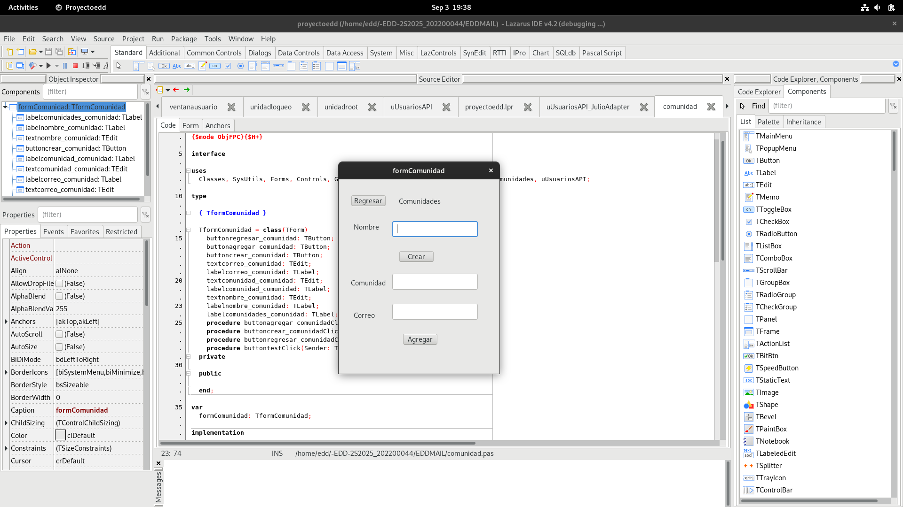

# Fase de Grupos

## -EDD- Proyecto 1
Universidad de San Carlos de Guatemala\
Escuela de Ciencias y Sistemas \
Segundo Semestre de 2025

- Julio Fernando Ramos Mus - 202200044
- Victor Hugo Velasquez - 202100054
- Brandon Eduardo Pablo Garcia - 202112092


## Introducción
EDD Mail es un programa que está creado en object pascal, introduce una serie de herramientas para el envío de correos electrónicos, así como correos programados y una serie de comunidades a las cuales el usuario podrá unirse.

## Implementación

Para la implementación se utilizarón 3 unidades nuevas de pascal, para que reutilizar la lista simple que cada integrante del grupo realizó.

### uUsuariosAPI
Se utilizó para enlazar las funciones de cada integrante en su lista simple.
```pascal
unit uUsuariosAPI;

{$mode ObjFPC}{$H+}

interface

type
  TUserExistsFunc = function (const Email: String): Boolean;

procedure UsersAPI_BindExists(Func: TUserExistsFunc);
function  UsersAPI_UserExists(const Email: String): Boolean;

implementation

var
  GUserExists: TUserExistsFunc = nil;

procedure UsersAPI_BindExists(Func: TUserExistsFunc);
begin
  GUserExists := Func;
end;

function UsersAPI_UserExists(const Email: String): Boolean;
begin
  if Assigned(GUserExists) then
    Result := GUserExists(Email)
  else
    Result := False; // si nadie nos enlaza, decimos que no existe
end;

end.

```
## uUsuariosAPI_(integrante)Adapter
Se llama desde el archivo principal lpr para validar que existen los usuarios en la lista simple.
```pascal
unit uUsuariosAPI_JulioAdapter;

{$mode ObjFPC}{$H+}

interface

uses SysUtils, uUsuarios, uUsuariosAPI;

function Julio_UserExists(const Email: String): Boolean;

implementation

function Julio_UserExists(const Email: String): Boolean;
var N: PUsuarioNode; E: String;
begin
  E := Trim(Email);

  // usa tu buscador directo
  N := FindByEmail(E);
  if N <> nil then Exit(True);

  // respaldo: recorrer por si el buscador fuera estricto
  N := GetHeadUsuarios; // o tu head global si no tienes esta función
  while N <> nil do
  begin
    if SameText(Trim(N^.data.email), E) then Exit(True);
    N := N^.next;
  end;

  Result := False;
end;

end.

```

## uComunidades
Lista de lista con sus metodos integrados para crear comunidades y apuntar a las listas simples de cada integrante
```pascal
unit uComunidades;

{$mode ObjFPC}{$H+}

interface

uses
  Classes, SysUtils, Process, uUsuariosAPI;

type
  PMember = ^TMember;
  TMember = record
    Email: String;
    Next : PMember;
  end;

  PComunidad = ^TComunidad;
  TComunidad = record
    Id      : Integer;
    Nombre  : String;
    Miembros: PMember;   // lista simple de miembros (por email)
    Next    : PComunidad;
  end;

var
  ComunidadesHead: PComunidad = nil;
  NextComunidadId: Integer = 1;

procedure Comunidades_Init;
function  Comunidades_Crear(const Nombre: String): Boolean; // False si ya existe o vacío
function  Comunidades_Eliminar(const Nombre: String): Boolean;
function  Comunidades_AgregarMiembro(const NombreComunidad, Email: String): Boolean; // False si no existe comunidad/usuario o duplicado
function  Comunidades_EliminarMiembro(const NombreComunidad, Email: String): Boolean;
procedure Comunidades_Listar(out S: String);

// Reporte: genera DOT y PNG en carpeta (por defecto "Root-Reportes")
procedure Comunidades_ReportePNG(const CarpetaSalida: String = 'Root-Reportes');
function  Comunidades_GenerarDOT(const DotPath: String): Boolean; // por si alguien quiere sólo el DOT

// Utilidad (opcional) para saber cuántos miembros tiene una comunidad
function  Comunidades_ContarMiembros(const NombreComunidad: String): Integer;

implementation

function EqualCI(const A,B: String): Boolean; inline;
begin
  Result := SameText(Trim(A), Trim(B));
end;

function _Esc(const S: string): string; inline;
begin
  Result := StringReplace(S, '"', '\"', [rfReplaceAll]);
end;

function _IdSafe(const S: string): string; inline;
var i: Integer;
begin
  Result := '';
  for i := 1 to Length(S) do
    if S[i] in ['A'..'Z','a'..'z','0'..'9','_'] then
      Result += S[i]
    else
      Result += '_';
end;

function _BuscarComunidad(const Nombre: String): PComunidad;
var C: PComunidad;
begin
  Result := nil;
  C := ComunidadesHead;
  while C <> nil do
  begin
    if EqualCI(C^.Nombre, Nombre) then Exit(C);
    C := C^.Next;
  end;
end;

function _MiembroExiste(C: PComunidad; const Email: String): Boolean;
var M: PMember;
begin
  Result := False;
  if (C = nil) then Exit;
  M := C^.Miembros;
  while M <> nil do
  begin
    if EqualCI(M^.Email, Email) then Exit(True);
    M := M^.Next;
  end;
end;

procedure Comunidades_Init;
begin
  ComunidadesHead := nil;
  NextComunidadId := 1;
end;

function Comunidades_Crear(const Nombre: String): Boolean;
var N: PComunidad;
begin
  Result := False;
  if Trim(Nombre) = '' then Exit;
  if _BuscarComunidad(Nombre) <> nil then Exit; // ya existe

  New(N);
  N^.Id       := NextComunidadId; Inc(NextComunidadId);
  N^.Nombre   := Trim(Nombre);
  N^.Miembros := nil;
  N^.Next     := ComunidadesHead; // insertamos al inicio (rápido)
  ComunidadesHead := N;
  Result := True;
end;

function Comunidades_Eliminar(const Nombre: String): Boolean;
var C, Prev: PComunidad; M, T: PMember;
begin
  Result := False;
  Prev := nil; C := ComunidadesHead;
  while C <> nil do
  begin
    if EqualCI(C^.Nombre, Nombre) then
    begin
      // liberar miembros
      M := C^.Miembros;
      while M <> nil do begin T := M^.Next; Dispose(M); M := T; end;
      // sacar de la lista
      if Prev = nil then ComunidadesHead := C^.Next else Prev^.Next := C^.Next;
      Dispose(C);
      Exit(True);
    end;
    Prev := C; C := C^.Next;
  end;
end;

function Comunidades_AgregarMiembro(const NombreComunidad, Email: String): Boolean;
var C: PComunidad; M: PMember;
begin
  Result := False;
  if (Trim(NombreComunidad)='') or (Trim(Email)='') then Exit;

  C := _BuscarComunidad(NombreComunidad);
  if C = nil then Exit; // no existe comunidad

  // Validar contra la lista de usuarios activa (Brandon o Víctor) vía callback
  if not UsersAPI_UserExists(Email) then Exit;

  if _MiembroExiste(C, Email) then Exit; // no duplicado

  New(M);
  M^.Email := Trim(Email);
  M^.Next  := C^.Miembros;
  C^.Miembros := M;
  Result := True;
end;

function Comunidades_EliminarMiembro(const NombreComunidad, Email: String): Boolean;
var C: PComunidad; M, Prev: PMember;
begin
  Result := False;
  C := _BuscarComunidad(NombreComunidad);
  if C = nil then Exit;

  Prev := nil; M := C^.Miembros;
  while M <> nil do
  begin
    if EqualCI(M^.Email, Email) then
    begin
      if Prev = nil then C^.Miembros := M^.Next else Prev^.Next := M^.Next;
      Dispose(M);
      Exit(True);
    end;
    Prev := M; M := M^.Next;
  end;
end;

procedure Comunidades_Listar(out S: String);
var C: PComunidad; M: PMember;
begin
  S := '';
  C := ComunidadesHead;
  while C <> nil do
  begin
    S += Format('Comunidad #%d: %s',[C^.Id, C^.Nombre]) + LineEnding;
    if C^.Miembros = nil then
      S += '  (sin miembros)' + LineEnding
    else
    begin
      M := C^.Miembros;
      while M <> nil do
      begin
        S += '  - ' + M^.Email + LineEnding;
        M := M^.Next;
      end;
    end;
    S += LineEnding;
    C := C^.Next;
  end;
  if S = '' then S := '(no hay comunidades)';
end;

function Comunidades_ContarMiembros(const NombreComunidad: String): Integer;
var C: PComunidad; M: PMember;
begin
  Result := 0;
  C := _BuscarComunidad(NombreComunidad);
  if (C = nil) or (C^.Miembros = nil) then Exit;
  M := C^.Miembros;
  while M <> nil do begin Inc(Result); M := M^.Next; end;
end;

function Comunidades_GenerarDOT(const DotPath: String): Boolean;
var
  sl: TStringList;
  C: PComunidad;
  M: PMember;
  prevCID, cid, uid, firstUID, lastUID: String;
  idx: Integer;
begin
  Result := False;
  sl := TStringList.Create;
  try
    sl.Add('digraph Comunidades {');
    sl.Add('  rankdir=LR;');
    sl.Add('  graph [nodesep=0.6, ranksep=1.0, splines=ortho];');
    sl.Add('  node  [shape=box, style=filled, fontname="Arial"];');
    sl.Add('');

    // Comunidades (azul claro) conectadas en cadena
    prevCID := '';
    C := ComunidadesHead;
    while C <> nil do
    begin
      cid := 'C' + IntToStr(C^.Id);
      sl.Add(Format('  %s [label="%s", fillcolor="#b3d9f2"];', [cid, _Esc(C^.Nombre)]));
      if prevCID <> '' then sl.Add(Format('  %s -> %s;', [prevCID, cid]));
      prevCID := cid;
      C := C^.Next;
    end;
    sl.Add('');

    // Miembros (amarillo claro) colgando de cada comunidad
    sl.Add('  node [fillcolor="#fff9c4"];');
    C := ComunidadesHead;
    while C <> nil do
    begin
      cid := 'C' + IntToStr(C^.Id);
      firstUID := ''; lastUID := ''; idx := 0;

      if C^.Miembros = nil then
      begin
        uid := Format('U_%s_vacio', [cid]);
        sl.Add(Format('  %s [label="(sin miembros)"];', [uid]));
        sl.Add(Format('  %s -> %s;', [cid, uid]));
      end
      else
      begin
        M := C^.Miembros;
        while M <> nil do
        begin
          Inc(idx);
          uid := Format('U_%s_%d_%s', [cid, idx, _IdSafe(M^.Email)]);
          sl.Add(Format('  %s [label="%s"];', [uid, _Esc(M^.Email)]));
          if firstUID = '' then firstUID := uid;
          if lastUID <> '' then sl.Add(Format('  %s -> %s;', [lastUID, uid]));
          lastUID := uid;
          M := M^.Next;
        end;
        sl.Add(Format('  %s -> %s;', [cid, firstUID]));
      end;

      sl.Add('');
      C := C^.Next;
    end;

    sl.Add('}');
    sl.SaveToFile(DotPath);
    Result := True;
  finally
    sl.Free;
  end;
end;

procedure Comunidades_ReportePNG(const CarpetaSalida: String);
var
  Carp, DotFile, PngFile: String;
  P: TProcess;
begin
  Carp := IncludeTrailingPathDelimiter(CarpetaSalida);
  if not ForceDirectories(Carp) then
    raise Exception.Create('No se pudo crear la carpeta de reportes: ' + Carp);

  DotFile := Carp + 'comunidades.dot';
  PngFile := Carp + 'comunidades.png';

  if not Comunidades_GenerarDOT(DotFile) then
    raise Exception.Create('No se pudo generar el archivo DOT de comunidades.');

  // Render con Graphviz
  P := TProcess.Create(nil);
  try
    P.Executable := 'dot';
    P.Parameters.Add('-Tpng');
    P.Parameters.Add(DotFile);
    P.Parameters.Add('-o');
    P.Parameters.Add(PngFile);
    P.Options := [poWaitOnExit];
    P.Execute;
    if P.ExitStatus <> 0 then
      raise Exception.Create('Error al ejecutar graphviz (dot).');
  finally
    P.Free;
  end;
end;

end.

```
## Lista de listas


## Implementación con Victor


## Implementación con Brandon


## Implementación con Julio
